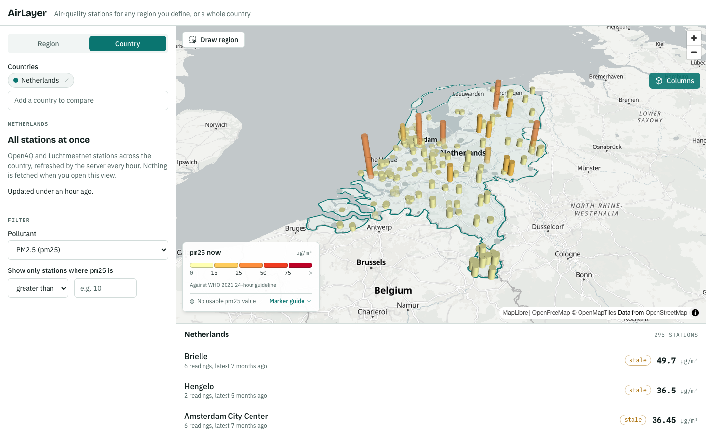
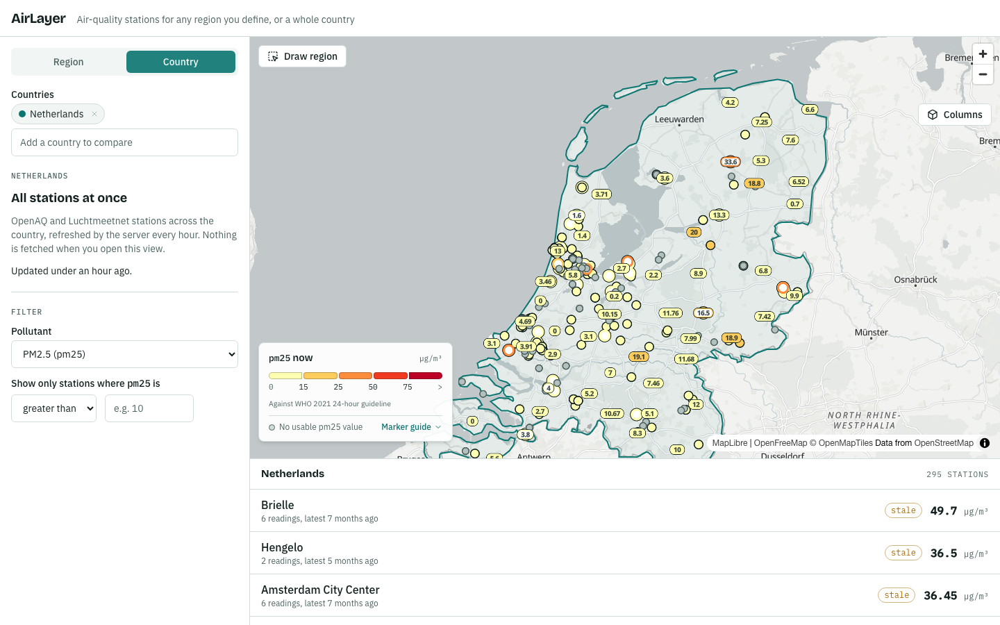
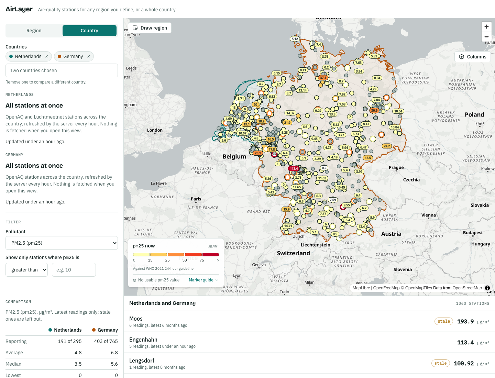

# AirLayer

AirLayer puts public air-quality monitoring data on a map. Pick an area, or a whole country, and see what every station nearby is reporting right now. Filter by pollutant and threshold, look at a station's last 24 hours, or put two countries side by side.

Data comes from [OpenAQ](https://openaq.org) (plus [Luchtmeetnet](https://www.luchtmeetnet.nl) for the Netherlands). The backend pulls it, validates it as untrusted input, and stores it. The frontend only ever talks to the AirLayer API.



## What it does

**Regions.** Search for a place or draw a rectangle on the map, then sync. A background worker pulls the stations OpenAQ has inside that box and the map shows them. A sync ends as `succeeded`, or as `failed` with a readable reason and no partial data.

**Countries.** An hourly background job builds a layer for each of 44 European countries (Europe in OpenAQ's list, plus Turkey). Opening the country view fetches nothing upstream; it reads what the server already built.



**Compare.** Choose a second country and both layers share one map, each with its own border colour. A table compares the chosen pollutant: how many stations report, plus average, median, lowest and highest.



**Filter.** Pick a pollutant and a condition ("PM2.5 greater than 15"). The server does the matching and the map and list narrow to the stations that pass.

**Columns.** Switch the map to 3D columns, with height and colour following the reading.

### Reading the map

- Marker colour is the reading's class against the [WHO 2021 24-hour guideline levels](https://www.who.int/publications/i/item/9789240034228) for PM2.5, PM10 and NO₂. It is not an air-quality index. Other pollutants use a ramp relative to the layer.
- A reading 24 hours old or older is marked **stale** (a hollow badge on the map). Stations are not filtered by age, so you can see which ones stopped reporting.
- Comparison figures leave stale readings out, so an old value does not pull the numbers toward a day that is not today.
- A grey dot is a station with no usable value for the chosen pollutant.

## Run it locally

You need Docker, Node and [uv](https://docs.astral.sh/uv/) (uv only for backend checks).

```sh
cp .env.example .env        # then set OPENAQ_API_KEY (free key from https://explore.openaq.org)
make up                     # PostGIS, migrations, API on :8001, region worker, national worker
cd frontend && npm install && npm run dev    # http://localhost:5173
```

The national layers are built by the hourly refresh, which takes around nine minutes for all countries, so the country view is empty until the first one finishes. Region syncs work straight away.

Without an `OPENAQ_API_KEY` the API starts, but syncs and refreshes cannot pull data.

## Checks

| Command | Runs |
|---|---|
| `make check` | Everything below |
| `make backend-check` | ruff, mypy (strict), pytest against a real PostGIS test database (needs `make up`) |
| `make frontend-check` | `tsc -b`, eslint, prettier, Vitest |
| `make e2e` | Playwright against the running stack |

CI does not exist yet, so nothing runs these automatically. See [docs/quality.md](docs/quality.md).

## How it is built

```
Browser (React) ──HTTP──▶ API (FastAPI) ──▶ PostgreSQL / PostGIS
                              │                     ▲
                              └── enqueue ──▶ Worker ┤
                                   │                 │
                                   └──HTTP──▶ OpenAQ ┘
```

- **Frontend:** React and strict TypeScript on Vite. MapLibre GL (via `react-map-gl`) draws the map and deck.gl the columns. TanStack Query holds server data, Zustand holds UI state, and Tailwind with shadcn/ui does the styling.
- **Backend:** Python, FastAPI and SQLAlchemy on PostgreSQL with PostGIS. Procrastinate, a Postgres-backed queue, runs the sync and national-refresh workers.
- **Boundaries:** the OpenAQ key lives only in the worker's environment. The API contract in [docs/api-contracts.md](docs/api-contracts.md) is the only coupling between frontend and backend. Schema changes go through Alembic migrations.

## Project docs

| Doc | What is in it |
|---|---|
| [docs/product.md](docs/product.md) | What the product is for, and what it deliberately is not |
| [docs/domain.md](docs/domain.md) | Entities and naming |
| [docs/architecture.md](docs/architecture.md) | Stack choices, boundaries, open decisions |
| [docs/api-contracts.md](docs/api-contracts.md) | Every endpoint, shape and error code |
| [docs/decisions/](docs/decisions/README.md) | Architecture decision records |
| [AGENTS.md](AGENTS.md) | How AI agents work in this repo; AirLayer is also a showcase of disciplined AI-assisted engineering |

## Status

A portfolio project, not a production service. It makes no claims about coverage or accuracy beyond what OpenAQ and Luchtmeetnet themselves report. Authentication is a development placeholder.
